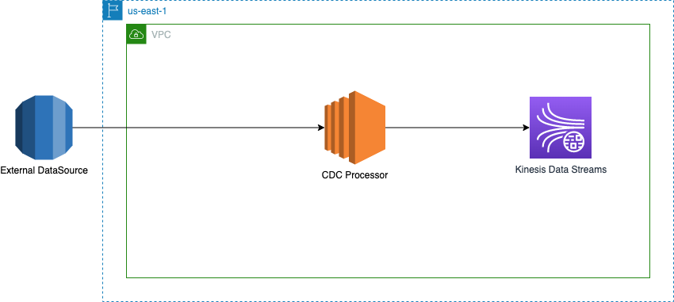
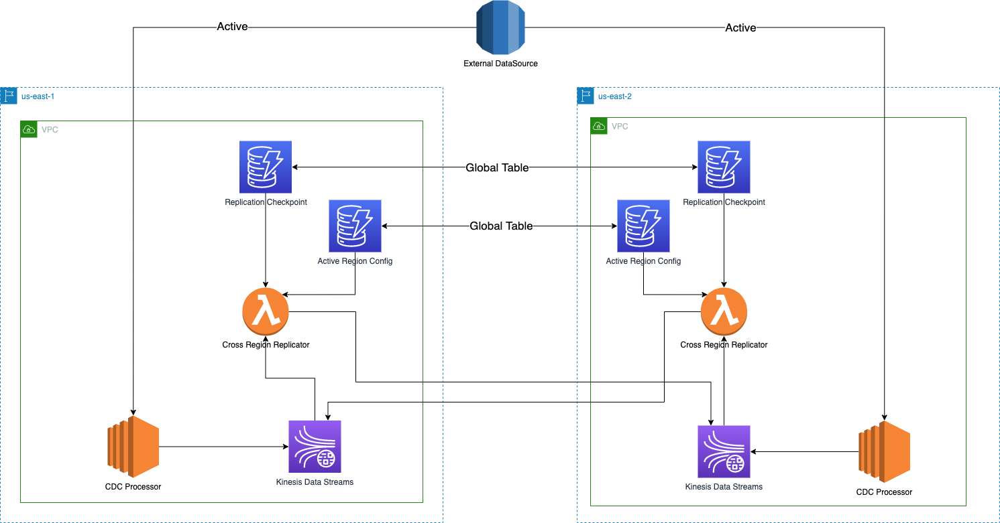
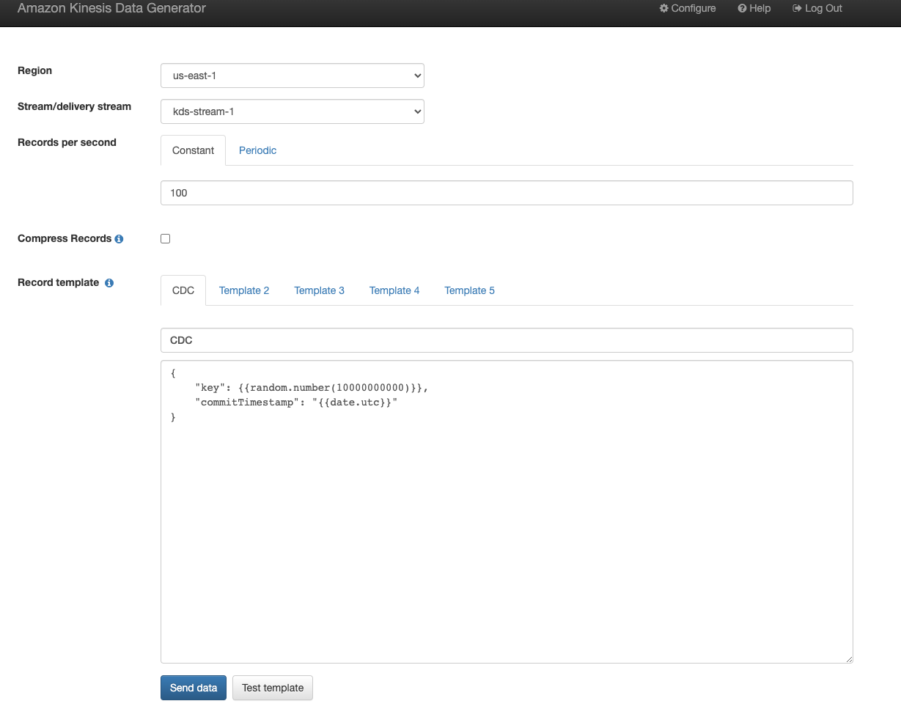

# A Continuous Data Capture(CDC) pipeline to AWS Kinesis Data Streams with Cross Region Replication & Checkpointing for Disaster Recovery

## Usecase:

1. There is a need to replicate data in a CDC manner to AWS environment from a remote data source (on-prem).
2. The goal is to enable consumers to operate out of any AWS region in the same AWS Account of choice, under the assumption that data is going to be available and accesible in the Kinesis Data Streams (KDS) in the region.
3. The primary goal is to ensure data is available and accessible in KDS in both the regions (consider two regions for this usecase), without any data loss.
4. Also, if there is a regional disaster, there is a need to know how much of data is available in any region within KDS. This is from an observability standpoint to tell the consumers of KDS as to how much of data is available.
5. Assume that the data from the remote data source comes with a Commit Timestamp of the transaction that is being replicated.

    ```json
    {    
       "key": 3174940031,    
       "commitTimestamp": "2021-11-10T00:48:30Z"
    }
    ```

The Single Region Architecture looks this way



## Solution:

### Prerequisites:

To deploy this application you will need AWS SAM and AWS CLI installed on your machine.

### Summary:

The solution is to replicate the CDC data from the remote data source to 1 AWS region, and then setup cross region custom replication between the KDS in both the regions.

This custom replication mechanism 
* would take care of checkpointing to a DynamoDB table. This table woulod primarily use the Commit Timestamp for checkpointing, which would accurately indicate the how much data has been replicated.
* uses Lambda Checkpointing to accuratelt resume from record failures within a batch
* uses a config DynamoDB table to know which region is active for a KDS stream

The hope is to have a failover automation process that takes care of failover activities when needed, and it makes use of the replication checkpoint to resume producing/replicatin data into KDS.

The Multi Region CDC Architecture solution is as shown below



### Cross Region Replicator Lambda:

The Cross Region Replicator is a Lambda function using the Enhanced Fan-Out pattern, that performs the following steps:

* For every batch of Kinesis records, the lambda function checks with the DynamoDB Table `kdsActiveRegionConfig` if the current stream name is active in the current AWS region where the function is invoked.

    The active region configuration within the table is expected to be as shown below:
    
    ```json
    {
	    "stream-name": "example-stream-1",
	    "active-region" : "us-east-1"
    }
    ```
  
  if the current region of the Lambda function does not match the active region for the stream, the function would just return without any activites.
  
* If the current AWS region is where the stream is active per configuration, then the function iterates over every record in the batch and does the following for each record:
    
    - Constructs a Kinesis PUT record request and sends it to the KDS in the other region
    - Updates the commit timestamp from the Kinesis record to the DynamoDB Table `kdsReplicationCheckpoint` to reflect accurately what was the last commit timestamp CDC data that was replicated.
        
    ```json
    {
    	"stream-name": "example-stream-1",
    	"last-timestamp-replicated" : "2021-11-10T00:48:30Z"
    }
    ```
    
    * If there is a failure, the sequence number of the record is tracked and the iteration is broken.
  
* The function returns the list of failed sequence numbers. If there are no failures, an empty list is returned which indicates the batch was successful.
  By returning the failed sequence number, the feature of [Lambda Checkpointing](https://aws.amazon.com/about-aws/whats-new/2020/12/aws-lambda-launches-checkpointing-for-amazon-kinesis-and-amazon-dynamodb-streams/) is used.

### Project Structure:

This project contains source code and supporting files for a serverless application that you can deploy with the SAM CLI. It includes the following files and folders.

* KinesisReplicatorFunction/src/main - Code for the application's Lambda function that replicates data between Kinesis Data Streams in two regions and checkpoints
* template.yaml - A template that defines the application's AWS resources.
* ddb-template.yml - A template to provision the DynamoDB Global Table resources that are needed.

## Deploy the sample application

### Step 1: Deploy the DynamoDB resources

* Create the tables in either us-east-1 or us-east-2. Since the tables are Global Tables, it is sufficient to run the stack in a single region.

```shell script
aws cloudformation create-stack --stack-name kdsReplicationDDBStack --template-body file://ddb-template.yml
```

* Populate the Active Region Config table

```shell script
aws dynamodb put-item --table-name kdsActiveRegionConfig --item '{"streamName": {"S": "kds-stream-1"}, "activeRegion": {"S": "us-east-1"}}'
```

### Step 2: Deploy the Application

* Use AWS SAM to deploy your application in both regions us-east-1 and us-east-2.

```shell script
sam build

export AWS_REGION="us-east-1"
sam deploy --guided

export AWS_REGION="us-east-2"
sam deploy --guided
```

### Step 3: Generate data for Kinesis Data Streams

* After the deployment is successful, it is necessary to populate the data in Kinesis Data Streams in us-east-1. use the [Kinesis Data Generator](https://awslabs.github.io/amazon-kinesis-data-generator/) to generate test data.
* The template of the test data payload can be as follows:

```json
{
    "key": {{random.number(10000000000)}},
    "commitTimestamp": "{{date.utc}}"
}
```



### Step 4: Validation

* Validate the Commit Timestamp written to the DynamoDB
* Validate the Lambda Logs in the active region, which should look like the sample below

```text
...
2021-10-12T14:25:06.536-05:00	2021-10-12 19:25:06 bce81bb9-344f-4545-8992-9329f2e58724 INFO Handler - Actual Record Data: { "key": 9505969289, "commitTimestamp": "2021-10-12T19:25:02Z"}
2021-10-12T14:25:06.543-05:00	2021-10-12 19:25:06 bce81bb9-344f-4545-8992-9329f2e58724 INFO Handler - Total Batch Size: 100, Successfully Processed: 100
```

* Validate the Lambda logs in the inactive region, which should look like the sample below

```text
2021-10-13 16:19:44 28b3bffe-133f-49a6-9626-dd8509797283 INFO  Handler - Stream kds-stream-1 is not active in the current region
```

### Step 5: Cleanup

Delete the stacks in both regions by using the following commands

```shell script
aws cloudformation delete-stack --stack-name kdsReplicationDDBStack

sam delete --region us-east-1

sam delete --region us-east-2
```

## Security

See [CONTRIBUTING](CONTRIBUTING.md#security-issue-notifications) for more information.

## License

This library is licensed under the MIT-0 License. See the LICENSE file.